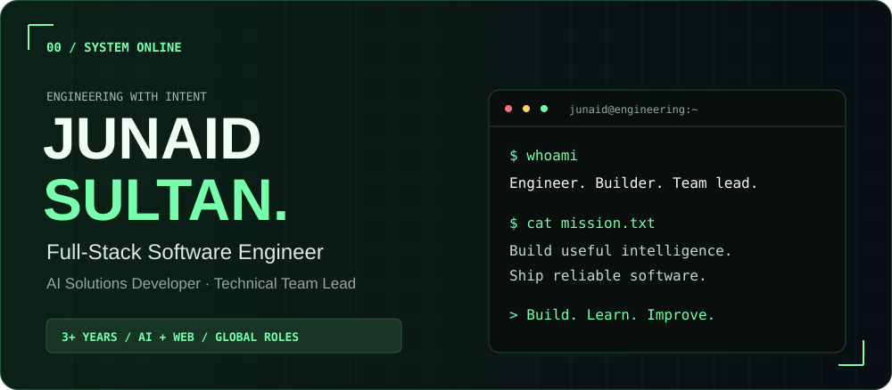
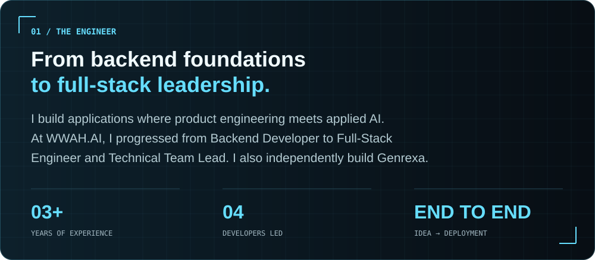
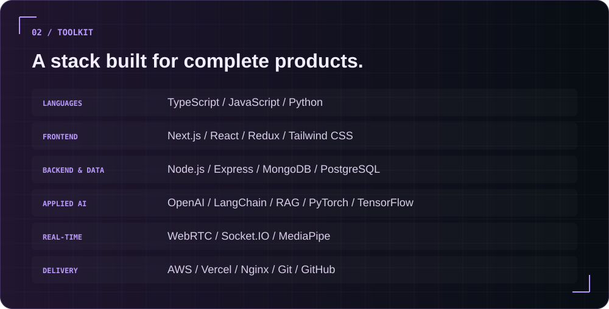
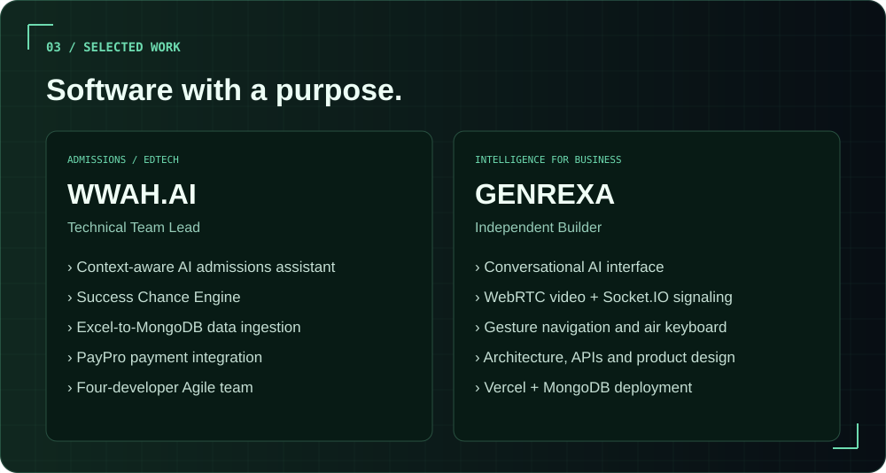
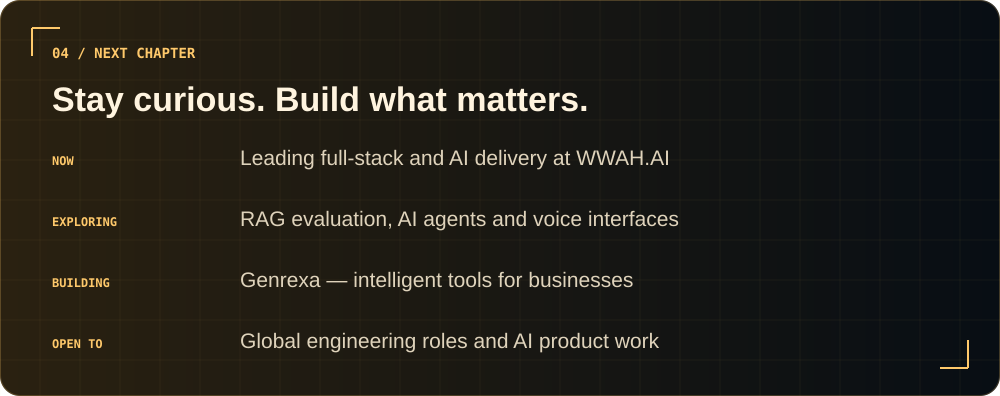
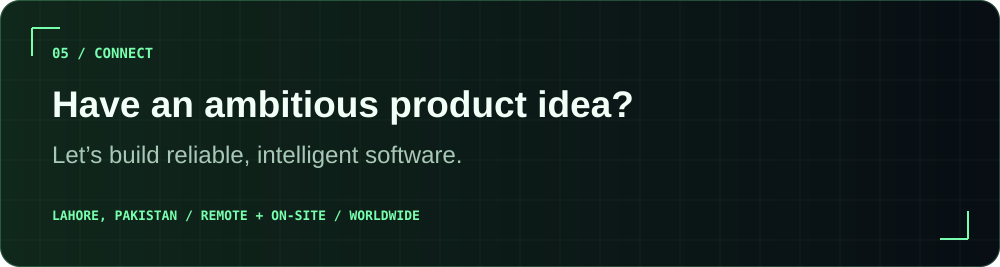

<!-- All visual assets are stored in this repository. No external image services. -->

<a href="https://genrexa.com"><strong>PORTFOLIO ↗</strong></a> &nbsp; / &nbsp;
<a href="https://www.linkedin.com/in/junaid-sultan-572101260/"><strong>LINKEDIN ↗</strong></a> &nbsp; / &nbsp;
<a href="mailto:junaidsultan92pk@gmail.com"><strong>EMAIL ↗</strong></a>

<strong>Read my engineering story</strong>

I’m **Junaid Sultan**, a Full-Stack Software Engineer and AI Solutions Developer. At **WWAH.AI**, I progressed from Backend Developer to Full-Stack Engineer and then Technical Team Lead.

I build **[Genrexa](https://genrexa.com)** independently, exploring AI automation, real-time communication and natural user interfaces. I care about clean architecture, useful AI, thoughtful interfaces and business value.

<strong>Explore project details</strong>

### WWAH.AI — Worldwide Admissions Hub

An admissions platform helping students discover programs and evaluate their eligibility.

- Built a context-aware RAG assistant using OpenAI, LangChain and MongoDB Vector Search.
- Designed the Success Chance Engine to compare student profiles with admission criteria.
- Automated Excel-to-MongoDB ingestion and integrated PayPro payments.
- Lead a four-developer team through two-week Agile sprints.

### [Genrexa — Intelligence for Business](https://genrexa.com)

My independent work in AI automation and real-time digital products.

- Built a voice-enabled conversational AI interface.
- Implemented video calling using WebRTC and Socket.IO signaling.
- Developed gesture navigation and an air keyboard with MediaPipe and TensorFlow.js.
- Handled architecture, UI, APIs, deployment and product direction.

<a href="mailto:junaidsultan92pk@gmail.com"><strong>START A CONVERSATION ↗</strong></a> &nbsp; / &nbsp;
<a href="https://www.linkedin.com/in/junaid-sultan-572101260/"><strong>CONNECT ON LINKEDIN ↗</strong></a>

